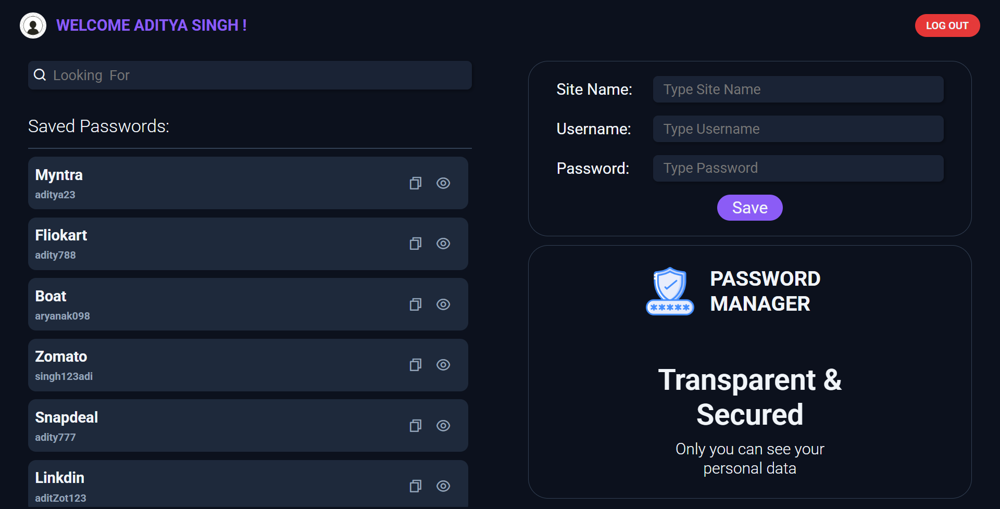
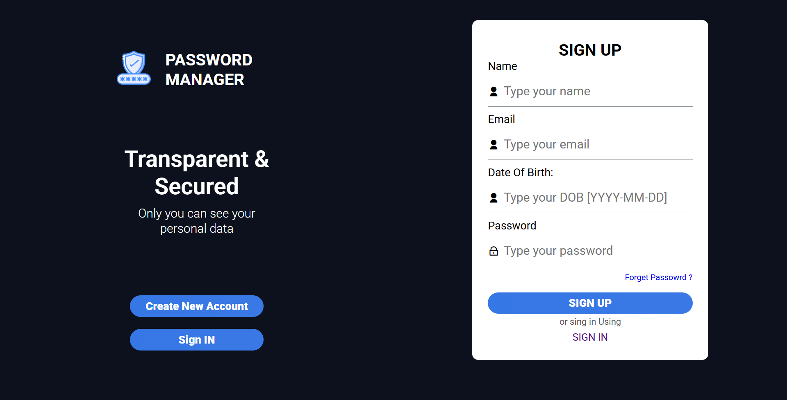

# 🔐 Password Manager

A secure and simple password manager built using **Express.js**, **MongoDB**, and **EJS**.

## 🌍 Deployment

Live Website:  
👉 **https://password-manager-k3k8.onrender.com/**

---

## 📌 About

This project allows users to securely store website credentials including **site name**, **username**, and **password**.  
Users can **sign up**, **log in**, and view their saved passwords through a clean and minimal UI.

All passwords are securely stored on the backend (hashed/encoded based on your implementation).

---

## 🚀 Features

- User Registration (Sign Up)
- User Login with authentication
- Add & Manage saved passwords
- Edit and Update existing saved passwords
- Copy password with one click
- Clean UI built using EJS templates
- Password visibility toggle
- Secure backend with Express + MongoDB


---

## 🖼 Demo Screenshots

### 🧑‍💻 Profile Page



### 📝 Sign Up Page



### 🔑 Login Page


---

## 🛠 Tech Stack

**Frontend:**

- HTML
- CSS
- EJS

**Backend:**

- Node.js
- Express.js
- MongoDB / Mongoose

**Security:**

- bcrypt (for password hashing)
- JWT

---

## 📦 Installation & Setup

Clone the repository:

```bash
git clone https://github.com/aditya-singhOfficial/Password-Manager.git
cd Password-Manager
```

Install dependencies:

```bash
npm install
```

Create a `.env` file in root:

```
PORT=8000
MONGO_URI=your_mongodb_connection_string
JWT_SECRET=your_jwt_secret
```

Run the project:

```bash
npm start
```

or (if you use nodemon)

```bash
npm run dev
```

Open in browser:

```
http://localhost:8000
```

---

## 📁 Project Structure

```
PASSWORDMANAGER/
├─ api/
├─ config/
├─ middlewares/
├─ models/
├─ public/
│  ├─ css/
│  ├─ js/
│  └─ images/
├─ routes/
├─ services/
├─ views/
│  ├─ index.ejs
│  ├─ profile.ejs
│  └─ signup.ejs
├─ .env
├─ .gitignore
├─ main.js
├─ package.json
└─ README.md
```

---

## 🤝 Contributing

Pull requests are welcome. For major changes, please open an issue first to discuss what you’d like to modify.

